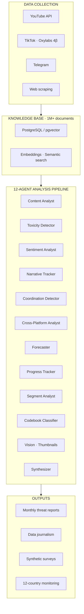

# FORESIGHT MAS

### Multi-Agent System for Information Ecosystem Analysis

**AI-powered disinformation detection and digital security research for civil society**

Developed by [FactCheck.LT](https://factcheck.lt) (VšĮ DigitalHub) · Vilnius, Lithuania

---

## Overview

FORESIGHT MAS is a multi-agent AI pipeline for systematic analysis of information manipulation across the Belarus-Russia media ecosystem and its impact on EU countries.

The system monitors cross-platform content (YouTube, TikTok, Telegram, web) in Russian, Belarusian, and other languages, detecting coordinated inauthentic behavior, tracking narrative manipulation, and producing automated threat assessments.

---

## Architecture

---

## Research Streams

### 1. Coordinated Inauthentic Behavior Detection

Cross-platform analysis detecting coordination patterns across YouTube, TikTok, and Telegram.

**Key results:**
- TikTok coordination networks identified with statistical significance **P<10⁻⁸⁰** during Polish presidential elections (53,357 videos, 5,924 accounts)
- Cross-border synchronization documented between Belarusian and Russian state media during Poland railway sabotage campaign (7-minute coordination window)
- Electoral interference patterns tracked across 4 EU countries

### 2. Multimodal Content Analysis

Monthly pipeline processing **1,700+ YouTube videos** with transcript analysis (codebook v3), Vision LLM thumbnail analysis for visual propaganda detection, and cross-platform narrative tracking.

### 3. Synthetic Survey Methodology

LLM-inferred attitudes methodology for estimating public opinion in information-restricted environments where traditional polling is impossible. Validated against **Chatham House Wave XVII** benchmarks. A/B faithfulness testing across multiple LLM providers.

### 4. Semantic Capture Analysis

Quantitative measurement of how state propaganda appropriates civil society terminology over time. Developed **Substitution Index** — a novel computational metric with characteristic V-curve patterns. Applied to 4-year longitudinal study of Ukraine war coverage (488,635 publications).

### 5. AI and Digital Security for Civil Society

Research on safe AI deployment for organizations operating under hostile digital surveillance (supported by German Marshall Fund). Threat modeling for activists using LLM-based tools, safe AI adoption frameworks, and train-the-trainer program: **44 CSO representatives** trained as "AI Champions."

---

## Data Sources

| Platform | Scale | Method |
|----------|-------|--------|
| YouTube | 16,000+ transcripts, 1,700+ videos/month | YouTube API |
| TikTok | 53,000+ videos (elections study) | Oxylabs Project 4β |
| Telegram | Channels monitoring | API collection |
| Web | News sites, state media | Web scraping |

**Total corpus:** 1,000,000+ documents in Russian, Belarusian, English, and other languages.

---

## Selected Publications

- **Monthly Foresight Reports** — How Belarusian state media talks about EU neighbours → [factcheck.lt](https://factcheck.lt)
- **TikTok & Polish Elections** — Coordinated manipulation analysis with P<10⁻⁸⁰ statistical proof
- **The Year of the Belarusian Woman** — Data journalism, 1M+ document corpus, 4 languages
- **Ukraine War Coverage** — 4-year analysis of 488,635 publications
- **FIMI Advent Calendar** — 31 global disinformation cases, 4 languages
- **Belarusian Media Landscape** — Chapter in "Беларусский ежегодник"

---

## Technology Stack

| Component | Tools |
|-----------|-------|
| Database | PostgreSQL + pgvector (semantic search) |
| LLM APIs | Anthropic Claude, OpenAI GPT |
| Automation | n8n workflow engine |
| Data collection | Oxylabs (pro bono), YouTube API, custom scrapers |
| Analysis | Python, multi-agent orchestration |
| Visualization | matplotlib, plotly, custom templates |

---

## Partners

| Partner | Role |
|---------|------|
| [Oxylabs](https://oxylabs.io/project-4beta) | Pro bono data infrastructure (Project 4β) |
| [Exolyt](https://exolyt.com) | TikTok social intelligence platform |

---

## About

[FactCheck.LT](https://factcheck.lt) (VšĮ DigitalHub, Lithuania) is a nonprofit research organization specializing in AI-powered disinformation analysis and digital security for civil society. Based in Vilnius, the organization provides analytical products for EU institutions, diplomatic missions, and independent media.

**Website:** [infopolicy.net](https://infopolicy.net)

---

## License

This repository contains methodology descriptions and documentation. The analytical pipeline code is not publicly available due to the sensitive nature of the work and operational security requirements. For research collaboration inquiries, please contact us through [infopolicy.net](https://infopolicy.net).

*© 2026 FactCheck.LT (VšĮ DigitalHub). Methodology descriptions may be referenced with attribution.*
